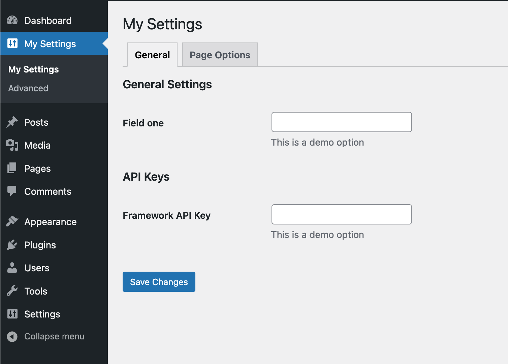

Create a custom settings page for your plugin or theme easily!

## Features
* Register Settings Page
* Register Settings SubPage
* Register Custom Fields to Taxonomies
* Get data easily.

## Documentation
https://github.com/yakupseymen/WPSF/wiki

## Changelog
https://github.com/yakupseymen/wpsf/releases
